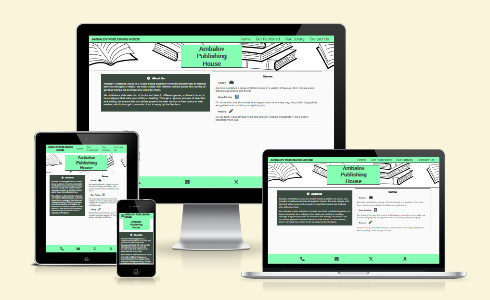
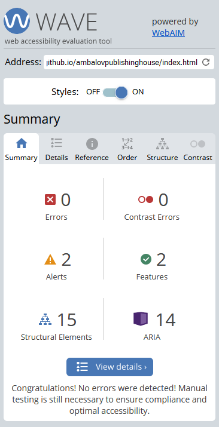
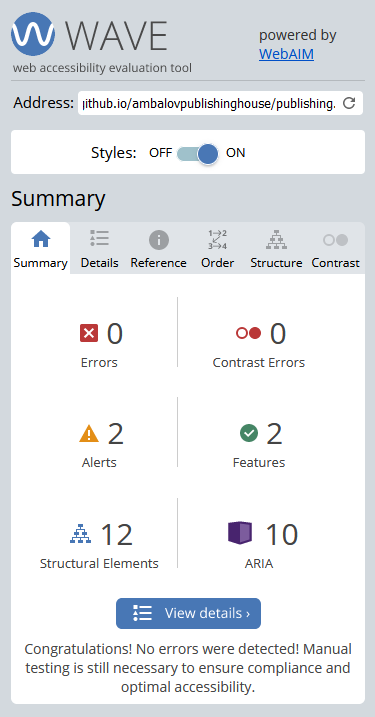
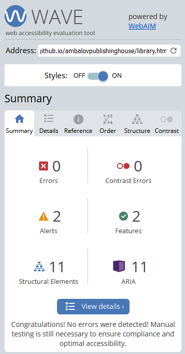
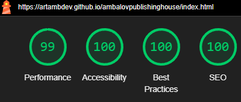
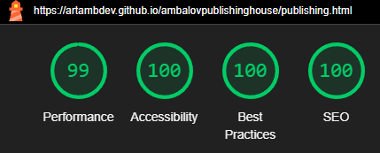
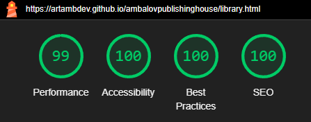
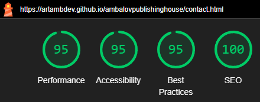

# Ambalov Publishing House
- developed by Arthur Ambalov

[Link to live webpage](https://artambdev.github.io/ambalovpublishinghouse/)

## Features

The website has 5 pages and X features across them.

### Pages
The five pages are:
- A homepage that users to the site are automatically brought to, and which contains information about the publishing house's work
- A "Get Published" page that instructs prospective writers and editors on the publishing process
- An "Our Library" page that displays some of the books published by the publisher, and highlights a featured book in particular
- A "Contact Us" page with a form to submit a request for contact with the user's information, and also provides information on the publisher's phone number, email and office location
- A custom 404 page that users are brought to when sent to an invalid page on the website, which provides a link back to the homepage and allows them to use the navigation menu to travel to any page

### Navigation menu
- The navigation menu is visible as a bar that is always at the top of the screen, and can be found on all 5 pages. It also features the company logo.
- On mobile, the menu is hidden until the user presses on the burger icon to toggle it, where it appears below the bar. The logo appears on the right side
- On tablets or larger screens, the menu is always visible at the right side of the bar, and the logo appears at the left.
- On laptops or larger screens, buttons highlight when hovered with the mouse.

### Footer
- The footer is visible as a bar with four icons at the bottom of every page. The icons present links to relevant contact information and important external websites.
- The phone and email icons both lead to the Contact Us page.
- The X icon leads to the X website (formerly known as Twitter).
- The Amazon icon leads to Amazon as expected.

### About Us section
- The About Us section displays a brief summary of the publisher's work and quality standards.

### Genres section
- A list of genres published by the company is presented for authors and readers to know what works they can get published or read respectively.

### Publishing Steps section
- This area on the Get Published page outlines the most important steps towards getting published by the company.

### Featured Book section
- This area highlights an especially popular book published by the company. It features the title, cover, a brief description and a quote from a reviewer, alongside a button leading to the Amazon page to buy the book.

### Other Books section
- This area highlights a few other notable books in lesser detail, in this case an art history book and a drama book.

### Contact form
- This form allows a user to submit a request for an e-mail from the company, with options to do so as a prospective writer, a questioning reader or an editor-for-hire. A longer-form message is required alongside the request.

### Alternative contact information
- This section notes the company's phone number and e-mail address for those who wish to contact them. The footer links directly to this section.

### Map
- An embedded interaction map from Google Maps shows the company's offices in Dublin.

## Validation

### HTML
All pages on the site are validated with the W3C's Markup Validation Service and show no errors or warnings. See each page below:

### CSS
The CSS style used by the site is valided with the W3C's CSS Validation Service, and shows no errors. One warning is presented for the external stylesheet of Google Fonts which cannot be checked. See below:

### Accessibility
All pages on the site are checked with the WAVE Website Accessibility Evaluation Tool, and show no errors. See each page below:

Homepage

Get Published

Our Library

Contact Us

### Performance
Google Chrome's Lighthouse feature is used to check every page for performance issues, and each returns a high score in all categories. See each page's result below:

Homepage

Get Published

Our Library

Contact Us

Welcome,

This is the Code Institute student template for Codeanywhere. If you are using Gitpod then you need [this template](https://github.com/Code-Institute-Org/gitpod-full-template) instead.  We have preinstalled all of the tools you need to get started. It's perfectly ok to use this template as the basis for your project submissions.

You can safely delete this README.md file, or change it for your own project. Please do read it at least once, though! It contains some important information about Codeanywhere and the extensions we use. Some of this information has been updated since the video content was created. The last update to this file was: **August 30th, 2023**

## Codeanywhere Reminders

To run a frontend (HTML, CSS, Javascript only) application in Codeanywhere, in the terminal, type:

`python3 -m http.server`

A button should appear to click: _Open Preview_ or _Open Browser_.

To run a frontend (HTML, CSS, Javascript only) application in Codeanywhere with no-cache, you can use this alias for `python3 -m http.server`.

`http_server`

To run a backend Python file, type `python3 app.py`, if your Python file is named `app.py` of course.

A button should appear to click: _Open Preview_ or _Open Browser_.

In Codeanywhere you have superuser security privileges by default. Therefore you do not need to use the `sudo` (superuser do) command in the bash terminal in any of the lessons.

To log into the Heroku toolbelt CLI:

1. Log in to your Heroku account and go to _Account Settings_ in the menu under your avatar.
2. Scroll down to the _API Key_ and click _Reveal_
3. Copy the key
4. In Codeanywhere, from the terminal, run `heroku_config`
5. Paste in your API key when asked

You can now use the `heroku` CLI program - try running `heroku apps` to confirm it works. This API key is unique and private to you so do not share it. If you accidentally make it public then you can create a new one with _Regenerate API Key_.

---

Happy coding!

Temp sources:

Featured book cover:
https://www.vecteezy.com/photo/21875238-dragon-black-and-white-ai-generated
<a href="https://www.vecteezy.com/free-photos">Free Stock photos by Vecteezy</a>

Art book cover:
https://www.freepik.com/free-photo/abstract-colorful-splash-3d-background-generative-ai-background_40007572.htm#query=background&position=4&from_view=keyword&track=sph&uuid=0107c16f-62b9-4950-ba15-45499fe640bb

Poetry book cover:
https://www.freepik.com/free-photo/dark-room-with-light-background_24651472.htm#query=background&position=7&from_view=keyword&track=sph&uuid=0107c16f-62b9-4950-ba15-45499fe640bb

Alternative contact background:
https://www.freepik.com/free-vector/beautiful-book-club-pattern-illustration_24022531.htm#query=book%20background&position=0&from_view=keyword&track=ais&uuid=bb63777c-ad49-4972-a736-27e633d0b2b1

Homepage hero image:
https://www.freepik.com/free-vector/books-seamless-pattern-doodle-outline-textbooks_21957290.htm#query=book%20background&position=1&from_view=keyword&track=ais&uuid=e7e2405d-6d8d-4ec5-9b85-63100ca3e73b

todo:
add 404 page
make sure no commented out code, add comments
html validate by URL
CSS validate by file
accessibility validate all pages
lighthouse validate all pages