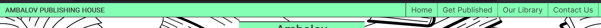
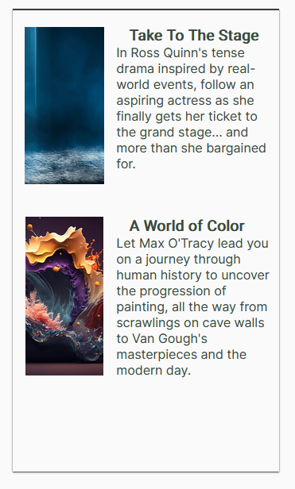

# Ambalov Publishing House
- developed by Arthur Ambalov

[Link to live webpage](https://artambdev.github.io/ambalovpublishinghouse/)

## User Stories

### User: Writer
- 1. As a writer, I want to get a feel of how the publisher presents itself
- 2. As a writer, I want to know the genres of books published by the company
- 3. As a writer, I want to know what process a writer goes through to get published
- 4. As a writer, I want to see how the company will promote my works
- 5. As a writer, I want to find a phone number or e-mail to discuss working with them
- 6. As a writer, I want to find the publisher's address so I can send a physical manuscript

### User: Reader
- 7. As a reader, I want to see if the company publishes books in a genre I enjoy
- 8. As a reader, I want to read about the books that the company has published
- 9. As a reader, I want to easily contact the company to ask about a book it has published
- 10. As a reader, I want to shop for the publisher's books online
- 11. As a reader, I want to find the publisher's social media page

### User: Editor
- 12. As an editor, I want to see where editors are involved in the publishing process
- 13. As an editor, I want to see the company's history of successful publishing
- 14. As an editor, I want to see where the company is based
- 15. As an editor, I want to find an e-mail address to send a resume to

## Features

The website has 5 pages and 10 features across them.

### Pages
The five pages are:
- A homepage that users to the site are automatically brought to, and which contains information about the publishing house's work
- A "Get Published" page that instructs prospective writers and editors on the publishing process
- An "Our Library" page that displays some of the books published by the publisher, and highlights a featured book in particular
- A "Contact Us" page with a form to submit a request for contact with the user's information, and also provides information on the publisher's phone number, email and office location
- A custom 404 page that users are brought to when sent to an invalid page on the website, which provides a link back to the homepage and allows them to use the navigation menu to travel to any page

### Navigation menu

- The navigation menu is visible as a bar that is always at the top of the screen, and can be found on all 5 pages. It also features the company logo.
- On mobile, the menu is hidden until the user presses on the burger icon to toggle it, where it appears below the bar. The logo appears on the right side
- On tablets or larger screens, the menu is always visible at the right side of the bar, and the logo appears at the left.
- On laptops or larger screens, buttons highlight when hovered with the mouse.

### Footer

- The footer is visible as a bar with four icons at the bottom of every page. The icons present links to relevant contact information and important external websites.
- The phone and email icons both lead to the Contact Us page.
- The X icon leads to the X website (formerly known as Twitter).
- The Amazon icon leads to Amazon as expected.
- This covers user stories 5, 10, 11 and 15.

### About Us section

- The About Us section displays a brief summary of the publisher's work and quality standards.
- This covers user story 1.

### Genres section

- A list of genres published by the company is presented for authors and readers to know what works they can get published or read respectively.
- This covers user stories 2 and 7.

### Publishing Steps section

- This area on the Get Published page outlines the most important steps towards getting published by the company.
- This covers user stories 3 and 12.

### Featured Book section

- This area highlights an especially popular book published by the company. It features the title, cover, a brief description and a quote from a reviewer, alongside a button leading to the Amazon page to buy the book.
- This covers user stories 4, 8, 10 and 13.

### Other Books section

- This area highlights a few other notable books in lesser detail, in this case an art history book and a drama book.
- This covers user stories 4, 8 and 13.

### Contact form

- This form allows a user to submit a request for an e-mail from the company, with options to do so as a prospective writer, a questioning reader or an editor-for-hire. A longer-form message is required alongside the request.
- This covers user stories 9.

### Alternative contact information

- This section notes the company's phone number and e-mail address for those who wish to contact them. The footer links directly to this section.
- This covers user stories 5 and 15.

### Map

- An embedded interaction map from Google Maps shows the company's offices in Dublin.
- This covers user stories 6 and 14.

## Validation

### HTML
All pages on the site are validated with the W3C's Markup Validation Service and show no errors or warnings. See each page below:

Homepage

Get Published

Our Library

Contact Us

404 page

### CSS
The CSS style used by the site is valided with the W3C's CSS Validation Service, and shows no errors. One warning is presented for the external stylesheet of Google Fonts which cannot be checked. See below:

No errors

Warning

### Accessibility
All pages on the site are checked with the WAVE Website Accessibility Evaluation Tool, and show no errors. See each page below:

Homepage

Get Published

Our Library

Contact Us

404 page

### Performance
Google Chrome's Lighthouse feature is used to check every page for performance issues, and each returns a high score in all categories. See each page's result below:

Homepage

Get Published

Our Library

Contact Us

404 page

### User Stories

- 2. As a writer, I want to know the genres of books published by the company
- 3. As a writer, I want to know what process a writer goes through to get published
- 4. As a writer, I want to see how the company will promote my works
- 5. As a writer, I want to find a phone number or e-mail to discuss working with them
- 6. As a writer, I want to find the publisher's address so I can send a physical manuscript

### User: Reader
- 7. As a reader, I want to see if the company publishes books in a genre I enjoy
- 8. As a reader, I want to read about the books that the company has published
- 9. As a reader, I want to easily contact the company to ask about a book it has published
- 10. As a reader, I want to shop for the publisher's books online
- 11. As a reader, I want to find the publisher's social media page

### User: Editor
- 12. As an editor, I want to see where editors are involved in the publishing process
- 13. As an editor, I want to see the company's history of successful publishing
- 14. As an editor, I want to see where the company is based
- 15. As an editor, I want to find an e-mail address to send a resume to

1. As a writer, I want to get a feel of how the publisher presents itself

| **Feature** | **Action** | **Expected Result** | **Actual Result** |
|-------------|------------|---------------------|-------------------|
| About Us section | Navigate to the homepage, locate the About Us section | Find a description of the publisher | Works as expected |

2. As a writer, I want to know the genres of books published by the company

| **Feature** | **Action** | **Expected Result** | **Actual Result** |
|-------------|------------|---------------------|-------------------|
| Genres section | Navigate to the homepage, locate the Genres section | Find a list of genres published | Works as expected |

3. As a writer, I want to know what process a writer goes through to get published

| **Feature** | **Action** | **Expected Result** | **Actual Result** |
|-------------|------------|---------------------|-------------------|
| Publishing Steps section | Navigate to the Get Published page, locate the publishing steps | Find a list of steps to getting published | Works as expected |

4. As a writer, I want to see how the company will promote my works

| **Feature** | **Action** | **Expected Result** | **Actual Result** |
|-------------|------------|---------------------|-------------------|
| Featured Book section | Navigate to the Our Library page, locate the Featured Book section | Find a noteworthy book advertised | Works as expected |
| Other Books section | Navigate to the Our Library page, locate the Other Books section | Find showcases of published books | Works as expected |

5. As a writer, I want to find a phone number or e-mail to discuss working with them

| **Feature** | **Action** | **Expected Result** | **Actual Result** |
|-------------|------------|---------------------|-------------------|
| Footer | Scroll to the bottom of the page, and click the phone or envelope icons | Be taken to a page with contact details | Works as expected |
| Alternative contact details | Navigate to the Contact Us page, scroll down, locate the alternative contact details section | Find an e-mail address | Works as expected |

6. As a writer, I want to find the publisher's address so I can send a physical manuscript

| **Feature** | **Action** | **Expected Result** | **Actual Result** |
|-------------|------------|---------------------|-------------------|
| Map | Navigate to the Contact Us section, scroll down, locate the embedded Google Map | Find the publisher's address | Works as expected |

7. As a reader, I want to see if the company publishes books in a genre I enjoy

| **Feature** | **Action** | **Expected Result** | **Actual Result** |
|-------------|------------|---------------------|-------------------|
| Genres section | Navigate to the homepage, locate the Genres section | Find a list of genres published | Works as expected |

8. As a reader, I want to read about the books that the company has published

| **Feature** | **Action** | **Expected Result** | **Actual Result** |
|-------------|------------|---------------------|-------------------|
| Featured Book section | Navigate to the Our Library page, locate the Featured Book section | Find a noteworthy book advertised | Works as expected |
| Other Books section | Navigate to the Our Library page, locate the Other Books section | Find showcases of published books | Works as expected |

9. As a reader, I want to easily contact the company to ask about a book it has published

| **Feature** | **Action** | **Expected Result** | **Actual Result** |
|-------------|------------|---------------------|-------------------|
| Contact form | Navigate to the Contact Us page, fill in details and enter a message, then hit "Send" | Send a message to the company's support team | Works as expected |

10. As a reader, I want to shop for the publisher's books online

| **Feature** | **Action** | **Expected Result** | **Actual Result** |
|-------------|------------|---------------------|-------------------|
| Footer | Scroll to the bottom of the page, and click the Amazon icon | Be taken to a page to buy books online | Works as expected |

11. As a reader, I want to find the publisher's social media page

| **Feature** | **Action** | **Expected Result** | **Actual Result** |
|-------------|------------|---------------------|-------------------|
| Footer | Scroll to the bottom of the page, and click the X icon | Be taken to the publisher's social media | Works as expected |

12. As an editor, I want to see where editors are involved in the publishing process

| **Feature** | **Action** | **Expected Result** | **Actual Result** |
|-------------|------------|---------------------|-------------------|
| Publishing Steps section | Navigate to the Get Published page, locate the publishing steps, read the second step | Find a list of steps to getting published | Works as expected |

13. As an editor, I want to see the company's history of successful publishing

| **Feature** | **Action** | **Expected Result** | **Actual Result** |
|-------------|------------|---------------------|-------------------|
| Featured Book section | Navigate to the Our Library page, locate the Featured Book section | Find a noteworthy book advertised | Works as expected |
| Other Books section | Navigate to the Our Library page, locate the Other Books section | Find showcases of published books | Works as expected |

14. As an editor, I want to see where the company is based

| **Feature** | **Action** | **Expected Result** | **Actual Result** |
|-------------|------------|---------------------|-------------------|
| Map | Navigate to the Contact Us section, scroll down, locate the embedded Google Map | Find the publisher's address | Works as expected |

15. As an editor, I want to find an e-mail address to send a resume to

| **Feature** | **Action** | **Expected Result** | **Actual Result** |
|-------------|------------|---------------------|-------------------|
| Footer | Scroll to the bottom of the page, and click the envelope icon | Be taken to a page with the publisher's e-mail address | Works as expected |
| Alternative contact details | Navigate to the Contact Us page, scroll down, locate the alternative contact details section | Find an e-mail address | Works as expected |

## Deployment

The website was deployed with GitHub's deployment platform, GitHub Pages. The following steps were followed:
- Click on the "Settings" tab of the project's repository
- On the left, under the "Code and automation" section of the settings, navigate to "Pages"
- Under the "branch" option, select "main" and save
- Refreshing after a minute will show a small banner with the live site's URL

### Forking
On this project's repository, at the upper-right-hand side, there is a "fork" button to create a fork of it.

## Credits

Free-with-attribution images used:
- Homepage hero image (not visible on mobile): <a href="https://www.freepik.com/free-vector/books-seamless-pattern-doodle-outline-textbooks_21957290.htm#query=book%20background&position=1&from_view=keyword&track=ais&uuid=e7e2405d-6d8d-4ec5-9b85-63100ca3e73b">upkylak on freepik.com</a>
- Featured book cover: <a href="https://www.vecteezy.com/photo/21875238-dragon-black-and-white-ai-generated">Elpremiumo Design on Free Stock photos by Vecteezy</a>
- Art book cover: <a href="https://www.freepik.com/free-photo/abstract-colorful-splash-3d-background-generative-ai-background_40007572.htm#query=background&position=4&from_view=keyword&track=sph&uuid=0107c16f-62b9-4950-ba15-45499fe640bb">maniacvector on freepik.com</a>
- Drama book cover: <a href="https://www.freepik.com/free-photo/dark-room-with-light-background_24651472.htm#query=background&position=7&from_view=keyword&track=sph&uuid=0107c16f-62b9-4950-ba15-45499fe640bb">vector_corp on freepik.com</a>
- Alternative contact background: <a href="https://www.freepik.com/free-vector/beautiful-book-club-pattern-illustration_24022531.htm#query=book%20background&position=0&from_view=keyword&track=ais&uuid=bb63777c-ad49-4972-a736-27e633d0b2b1">freepik on freepik.com</a>

Code:
- Code for 404 page functionality was taken from <a href="https://docs.github.com/en/pages/getting-started-with-github-pages/creating-a-custom-404-page-for-your-github-pages-site">GitHub's documentation for GitHub Pages</a>

Other:
- Mo Shami for mentoring, guidance and feedback throughout the project.

todo:
style 404 page
make sure no commented out code, add comments
html validate by URL
CSS validate by file